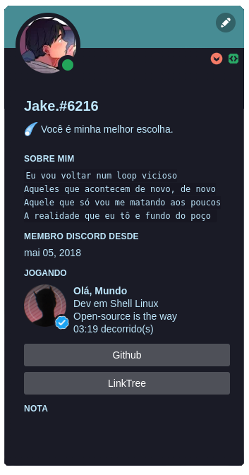

# Pagina inicial



  

> Script para presença no discord com botoes funcionais e customização.

### O projeto

Este é apenas um projeto pessoal para meus usos pessoais, está bem vindo a usar parte do codigo caso o convenha

## ☕ Utilizando o script

```
Apenas coloque sua id na caixa "client_id" e altere os textos, imagens e botões
```

## 📫 Contribua para a pagina!

Para criar seu fork, siga estas etapas:

1. Bifurque este repositório.
2. Crie um branch: `git checkout -b main`.
3. Faça suas alterações e confirme-as: `git commit -m 'Seu commit'`
4. Envie para o branch original: `git push origin startpage / local`
5. Crie a solicitação de pull.

Como alternativa, consulte a documentação do GitHub em [como criar uma solicitação pull](https://help.github.com/en/github/collaborating-with-issues-and-pull-requests/creating-a-pull-request).
